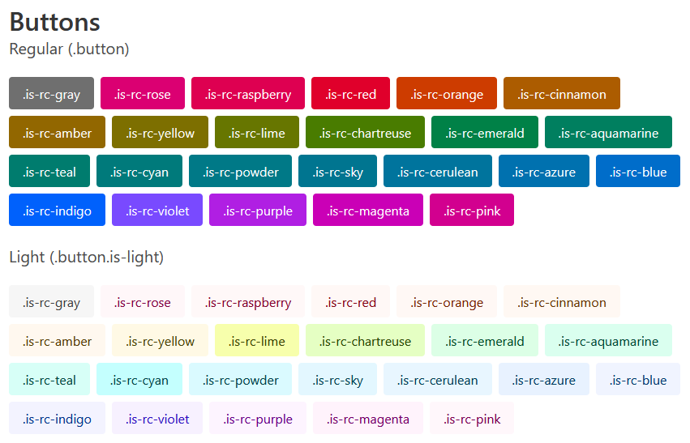

# bulma-reasonable-colors

CSS classes for using
[reasonable-colors](https://reasonable.work/colors/)
with
[Bulma](https://bulma.io/).

[View the test page](https://cityssm.github.io/bulma-reasonable-colors/test/index.htm) for more examples.

## Features

-   Includes Bulma-like class names for all six shades of all 25 colors in the reasonable-colors palette.
-   Accessible defaults.

## Usage

To avoid collisions with future Bulma updates,
all class names include `rc-` before the color name and shade.

For example, to set the text color to the fourth shade of teal,
use the class `.has-text-rc-teal-4`.

## Classes so Far

-   `.has-text-rc-[colorName]-[shadeNumber]`
-   `.has-background-rc-[colorName]-[shadeNumber]`
-   `.button.is-rc-[colorName]`

## In the Works

-   Alert colors, navbar colors, panel colors, and other Bulma elements and components.
